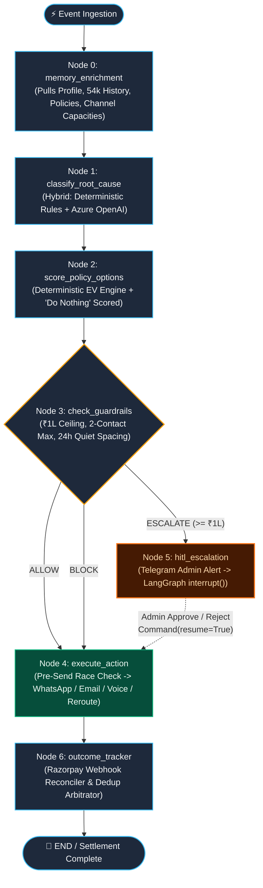

# AGENTS.md — Revenue Recovery Orchestrator Agent System Guidelines

## System Overview

The **Revenue Recovery Orchestrator** is an enterprise-grade, supervisory decision engine designed for Razorpay AI Buildathon (Track 3: AI Revenue Recovery). It proactively detects at-risk revenue (degraded payment routes, checkout drop-offs, failed subscriptions, overdue B2B receivables, RBI >₹15,000 mandate failures, and promise-to-pay commitments), enriches events with a **4-tier behavioral memory layer**, computes Expected Value (EV) across candidate recovery interventions, enforces deterministic financial guardrails, and safely executes multi-channel actions with Human-in-the-Loop (HITL) escalation and cryptographic audit logging.

---

## Architectural Principles & Agent Philosophy

1. **Separation of Reasoning & Financial Control**
   - LLMs are used exclusively for **classification disambiguation, intent reasoning, customer narrative context synthesis, and candidate intervention generation**.
   - Money movement, ranking, and execution gates are strictly controlled by **deterministic EV calculation** and **hard-coded compliance guardrails**.
   - An LLM never directly dispatches an unverified financial transaction or un-gated customer message.

2. **4-Tier Stateful Memory Layer**
   - Decisions are conditioned on customer behavioral priors (`customer_profiles`, `customer_episodes` [54k historical episodes], `merchants`, and `telegram_chats`).
   - Prior to reasoning, Node 0 (`memory_enrichment`) enriches state with payment reliability, channel response rates, and language preference.

3. **"Do Nothing" as a First-Class Scored Decision**
   - Many recovery tools spam customers indiscriminately, causing brand fatigue and high friction penalties.
   - The policy engine models customer behavioral priors: if a customer with a 95% on-time payment track record is 2 days late, `do_nothing` frequently yields the highest net expected value ($EV = P(\text{recovery}) \times \text{amount} - \text{friction}$).

4. **Replay-Safe Human-in-the-Loop (HITL)**
   - LangGraph `interrupt()` pauses execution when an action exceeds authorization boundaries (e.g. amount $\ge \text{₹1,00,000}$ or high risk).
   - The HITL node proactively dispatches an interactive Telegram alert to merchant admins with Approve/Reject actions before calling `interrupt()`.
   - Because LangGraph re-executes the interrupted node from the beginning on resumption via `Command(resume=...)`, the interrupt node must remain functional. All real-world actions are strictly isolated to the downstream `Executor` node.

5. **Race-Condition-Resilient Outcome Tracking**
   - Real-world payment systems experience out-of-order webhooks: `payment.failed` followed immediately by `payment.captured`.
   - The Orchestrator registers pending recovery actions in an active queue. If a `payment.captured` webhook or customer self-service payment arrives before execution, the outcome tracker instantly cancels the pending intervention and marks zero duplicate contacts in the audit log.

6. **Cryptographic SHA-256 Audit Chaining**
   - Every node decision, rule execution, and outcome is logged with a SHA-256 hash chained to the previous entry, providing tamper-evident logging for compliance audits.

---

## Graph Topology & Node Responsibilities



```
[Event Ingestion] 
       │
       ▼
[Node 0: memory_enrichment] ──── (Pulls Profile, 54k History, Policies, Channel Stats)
       │
       ▼
[Node 1: classify_root_cause] ── (Hybrid: Hard rules + Azure OpenAI)
       │
       ▼
[Node 2: score_policy_options] ─ (Deterministic EV Calculation + "Do Nothing" Scored)
       │
       ▼
[Node 3: check_guardrails] ───── (Enforces ₹1L Cap, 2-Contact Max, 24h Quiet Window)
       │
   ┌───┴───┐
   │       │
[ALLOW] [ESCALATE]
   │       │
   │       ▼
   │   [Node 5: hitl_escalation] ── (Telegram Merchant Alert -> LangGraph interrupt())
   │       │ (resume)
   └───┬───┘
       │
       ▼
[Node 4: execute_action] ──────── (WhatsApp -> Telegram -> Resend Email -> Reroute)
       │
       ▼
[Node 6: outcome_tracker] ────── (Razorpay webhook reconciler & dedup arbitrator)
       │
       ▼
     [END]

* Tamper-Evident SHA-256 Audit Trail: `log_audit_entry` is called inline within every node and state transition, persisting to local ledger, Supabase `audit_log` (details JSONB), and Langfuse Cloud.
```

---

## Root-Cause Categories (6-Class Schema)

1. `payment_degraded`: Bank route or gateway degradation. Never contact customer; trigger silent payment reroute / backoff retry.
2. `mandate_auth_failed`: RBI recurring mandate > ₹15,000 missing Additional Factor Authentication (AFA). Send mandate re-auth consent link.
3. `subscription_failed`: Recurring card/mandate failure (expired card, temporary insufficient balance, soft decline).
4. `checkout_abandoned`: High-intent cart drop-off within 15–60 min window. Dynamic payment link + light incentive if high EV.
5. `receivable_overdue`: B2B overdue invoice with net terms analysis. Progressive escalation based on customer payment history.
6. `promise_to_pay`: Customer agreed to pay on a specific date ($T_{promised}$). Pause outreach; schedule re-check at $T_{promised} + 24\text{h}$.

---

## Guardrail Invariants

- **Max Contact Rule**: Never exceed 2 customer outreach attempts per incident.
- **Dedup Rule**: Enforce a 24-hour quiet period across channels for identical `customer_id`.
- **Amount Authorization**: Any automated intervention on amounts $\ge \text{₹1,00,000}$ triggers mandatory human approval (`ESCALATE`).
- **Opt-Out Compliance**: Immediate permanent block upon receiving opt-out / stop keywords.
- **Zero Duplicate Contacts**: Hard operational invariant ($= 0$).

---

## Conventions for AI Pair Programmers

- Keep Python code strictly typed (`TypedDict`, `pydantic`, `Annotated[..., add_messages]`).
- Do not log or commit real credentials. Always load from `.env` or system environment.
- Use structured JSON outputs from Azure OpenAI.
- Maintain test coverage across failure injection modes in `tests/failure_injection/`.
