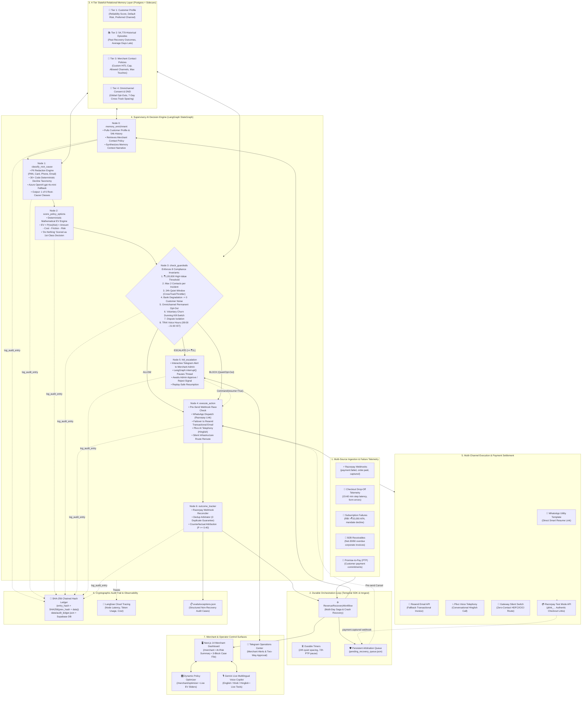

# Architecture — Revenue Recovery Intelligence Platform

## 1. System High-Level Topology: Durable Outer Loop + Reasoning Engine

The **Revenue Recovery Intelligence Platform** is architected around a fundamental separation of concerns:
1. **Durable Outer Workflow Engine (Temporal & Inngest)**: Owns the multi-day process lifecycle, durable timers (24h quiet windows, 3-day PTP pauses), retry backoff, webhook race-condition arbitration (`payment.captured` signals), and crash recovery across process restarts.
2. **Deterministic Reasoning Sub-Step (LangGraph + EV Engine)**: Owns failure root-cause classification (rules-first + LLM fallback), deterministic Expected Value (EV) calculation, and hard financial guardrails.
3. **Exact Structured Relational Memory (PostgreSQL via Prisma)**: Manages customer priors (54,779 historical episodes) and merchant contact policies using exact relational queries rather than fuzzy semantic vector recall.



---

## 2. State Schema (`RecoveryState`)

```python
class RecoveryState(TypedDict):
    event_id: str
    event_type: Literal[
        "subscription_failed",
        "checkout_abandoned",
        "receivable_overdue",
        "payment_degraded",
        "mandate_auth_failed",
        "promise_to_pay"
    ]
    amount: float
    currency: str
    merchant_id: str
    customer_id: str
    customer_name: str
    customer_email: str
    customer_phone: str
    created_at: str
    razorpay_ref: str | None
    
    # Customer context
    history: dict
    metadata: dict

    # 4-Tier Memory Layer (Node 0 output)
    customer_profile: dict | None        # Full profile from customer_profiles
    episodic_history: list[dict] | None  # Last N historical episodes
    merchant_policy: dict | None         # Merchant contact & escalation policy
    channel_capacity: dict | None        # Remaining daily slots per channel
    memory_context: str | None           # Plain-text narrative for LLM injection

    # Step 1: Root-Cause Classification Output
    root_cause: str | None
    confidence: float | None
    classification_reasoning: str | None
    candidate_actions: list[dict] | None
    
    # Step 2: Policy Engine (EV Calculation) Output
    chosen_action: dict | None
    expected_value: float | None
    ev_breakdown: dict | None
    
    # Step 3: Guardrail Validation
    guardrail_result: Literal["ALLOW", "ESCALATE", "BLOCK"] | None
    guardrail_rule_fired: str | None
    
    # Step 4: Execution & Channel Dispatches
    contact_count: int
    channel_used: Literal["whatsapp", "email", "telegram", "reroute", "scheduled_check", "none"] | None
    execution_result: dict | None
    
    # Step 6: Outcome Tracking & Webhook Reconciler
    payment_status: Literal["unresolved", "recovered", "cancelled_by_webhook", "failed"]
    recovered_amount: float
    recovered_at: str | None
    
    # Step 7: Audit Trail
    audit_trail: list[dict]
```

---

## 3. Mathematical Policy Formulation

For any event $E$ with amount $A$, and candidate action $a \in \mathcal{A}$:

$$\text{EV}(a) = P(\text{recovery} \mid a, E, \text{history}) \times A - C(a) - F(a, N_{\text{contacts}}) - R(a, A)$$

Where:
- $P(\text{recovery} \mid a, E, \text{history}) = \text{base\_prior}(a, \text{root\_cause}) \times f(\text{customer\_reliability}, \text{channel\_effectiveness})$
- $C(a)$: Direct execution cost (WhatsApp ₹0.80, Telegram ₹0.00, Email ₹0.05, API Reroute ₹0.00, Human review ₹50.00).
- $F(a, N_{\text{contacts}})$: Customer friction / annoyance penalty exponential in contact count ($F = \lambda \cdot N_{\text{contacts}}^2$).
- $R(a, A)$: Risk of churn/alienation on high amounts if contacted clumsily.

If $\text{EV}(\text{do\_nothing}) > \max_{a \neq \text{do\_nothing}} \text{EV}(a)$, the system intentionally remains silent.

---

## 4. API Endpoints

- `POST /api/orchestrator/process-event`: Trigger full recovery graph on a single event.
- `POST /api/orchestrator/resume-hitl`: Resume paused graph from human decision.
- `POST /api/webhooks/razorpay`: Razorpay webhook ingestion endpoint.
- `GET /api/customers/{customer_id}`: Full customer intelligence profile, episodic history, and AI behavioral overview.
- `GET /api/merchants/{merchant_id}/customers`: Paginated, risk-ranked customer directory.
- `GET /api/merchants/{merchant_id}/at-risk-summary`: Aggregated portfolio revenue risk summary.
- `POST /api/customers/{customer_id}/link-telegram`: Connect customer ID to Telegram `chat_id`.
- `WS /ws/gemini-live`: Real-time voice interaction WebSocket endpoint.
