# ⚡ Razorpay Revenue Recovery Orchestrator

> **Track 3: AI Revenue Recovery** — Supervisory decision engine that governs cart drop-offs, subscription declines, B2B overdue receivables, and RBI >₹15,000 mandates.

---

## 📊 Measured Benchmark (`evals/labeled_holdout.json`, 150 events, ₹97,50,738.00 at risk)

*Recovered ₹ in benchmark reflects simulated conversion thresholds ($P \ge 0.40$). Real money movement is verified separately in Razorpay Test Mode checkout verification.*

| Metric | Arm 0 (Organic) | Arm 1 (Naive Blast) | Arm 2 (Rule-Based Engine) | Arm 3 (AI Orchestrator) |
|---|---|---|---|---|
| **Gross Simulated ₹** | ₹19,45,253.00 (19.95%) | ₹55,43,558.00 (56.85%) | ₹66,60,365.00 (68.31%) | **₹32,62,834.00 (33.46%)** |
| **Incremental vs Organic** | ₹0.00 (Baseline) | ₹35,98,305.00 | ₹47,15,112.00 | **+₹13,17,581.00** |
| **Outreach Contacts Sent** | 0 (Zero Contact) | 150 | 113 | **39 (65% Less Customer Noise)** |
| **Duplicate Breaches** | 0 | 24 | 17 | **0 (Guaranteed 0)** |
| **Human Escalations (HITL)**| 0 (No Gates) | 0 (No Gates) | 0 (No Gates) | **27 (18.00% Paused)** |
| **Channel / API Cost** | ₹0.00 | ₹120.00 | ₹74.65 | **₹35.25** |

> 💡 **Why Rule-Based Engines Show Higher Gross ₹ (and why that's deceptive):**
> Dumb rule engines recover more gross ₹ simply because they have **zero safety gates**: they blast every high-value enterprise customer without authorization and rack up **17 duplicate contact breaches** violating the 24h quiet window.
> The AI Orchestrator is **compliance-gated**: it achieves **+₹13.18L incremental recovery** with **65% less customer noise (39 contacts vs 113)**, **guarantees 0 duplicate contacts**, and safely holds 27 high-value accounts ($\ge \text{₹1,00,000}$) for human review.
> When human admins sign off on high-value escalations, the **counterfactual recovery rises to ₹67,67,454.00 (69.40%)** with **zero compliance risk**.

---

## 🛡️ Core Invariants

1. **Deterministic EV Engine**: Computes Net Expected Value ($EV = P \cdot A - C - F - R$); scores *do nothing* as a first-class candidate.
2. **Hard Guardrails**: ₹1,00,000 HITL cap, 2-contact maximum, and 24-hour quiet window via persistent sidecar throttler.
3. **Webhook Race Arbitration**: Active queue cancels pending outreach immediately upon receiving `payment.captured` (0 duplicate spam).
4. **Cryptographic SHA-256 Audit**: Append-only hash-chained ledger verifying every decision.

---

## 🏗️ System Architecture

### 1. End-to-End Recovery Pipeline

```mermaid
flowchart TD
    %% ─────────────────────────────────────────────────────────────
    %% STAGE 1: INGESTION
    %% ─────────────────────────────────────────────────────────────
    subgraph S1["⚡ 1. Multi-Source Ingestion & Telemetry"]
        direction LR
        I1["Razorpay Webhooks<br/>(payment.failed, captured)"]
        I2["Checkout Drop-Off<br/>(15–60 min cart latency)"]
        I3["Subscriptions & Mandates<br/>(RBI >₹15k AFA declines)"]
        I4["B2B Overdue Invoices<br/>(Net-30/60 terms)"]
    end

    %% ─────────────────────────────────────────────────────────────
    %% STAGE 2: 4-TIER MEMORY LAYER
    %% ─────────────────────────────────────────────────────────────
    subgraph S2["🧠 2. 4-Tier Stateful Memory Layer (PostgreSQL + Sidecars)"]
        direction LR
        M1["Tier 1: Customer Profile<br/>(Reliability, Risk Score, Language)"]
        M2["Tier 2: 54,779 Episodes<br/>(Past Recovery Outcomes)"]
        M3["Tier 3: Merchant Policy<br/>(HITL Caps, Allowed Channels)"]
        M4["Tier 4: Omnichannel Consent<br/>(Global Opt-Outs, 7d Spacing)"]
    end

    %% ─────────────────────────────────────────────────────────────
    %% STAGE 3: DECISION ENGINE (LANGGRAPH)
    %% ─────────────────────────────────────────────────────────────
    subgraph S3["🤖 3. Supervisory Decision Engine (LangGraph 7-Node StateGraph)"]
        N0["Node 0: memory_enrichment<br/>(Pulls behavioral priors & policy)"]
        N1["Node 1: classify_root_cause<br/>(Hybrid: 30+ Error Rules + Azure OpenAI)"]
        N2["Node 2: score_policy_options<br/>(Deterministic EV Engine + 'Do Nothing' Scored)"]
        N3{"Node 3: check_guardrails<br/>(₹1L Ceiling • 2-Contact Max • 24h Cooldown)"}
        
        N5["Node 5: hitl_escalation<br/>(Telegram Alert -> LangGraph interrupt())"]
        N4["Node 4: execute_action<br/>(Pre-Send Race Check -> Dispatch Link)"]
        N6["Node 6: outcome_tracker<br/>(Razorpay Webhook Reconciler & Dedup Arbitrator)"]

        N0 --> N1 --> N2 --> N3
        N3 -- "ALLOW" --> N4
        N3 -- "ESCALATE (≥ ₹1,00,000)" --> N5
        N3 -- "BLOCK" --> N4
        N5 -. "Admin Approve / Reject<br/>Command(resume=True)" .-> N4
        N4 --> N6
    end

    %% ─────────────────────────────────────────────────────────────
    %% STAGE 4: EXECUTION & CONTROL SURFACES
    %% ─────────────────────────────────────────────────────────────
    subgraph S4["🚀 4. Multi-Channel Execution & Control Surfaces"]
        direction LR
        CH_WA["💬 WhatsApp Utility<br/>(1-Click Checkout Link)"]
        CH_EM["📧 Resend Email API<br/>(Transactional Invoice)"]
        CH_VOICE["📞 Plivo AI Telephony<br/>(Hinglish Recovery Call)"]
        CH_REROUTE["🔀 Silent Gateway Reroute<br/>(Zero Customer Contact)"]
    end

    subgraph S5["🔐 5. Cryptographic Audit & Merchant Surfaces"]
        direction LR
        AUDIT["🔐 SHA-256 Chained Ledger<br/>(entry_hash = SHA256(prev + data))"]
        DASH["🖥️ Next.js Merchant Dashboard<br/>(Live Case Files • Policy Optimizer)"]
        VOICE_COPILOT["🎙️ Gemini Live Copilot<br/>(Multilingual Voice Supervisor)"]
    end

    %% Pipeline Flow
    S1 ==> S2
    S2 ==> N0
    N4 ==> S4
    N6 ==> S5

    classDef stageStyle fill:#0f172a,stroke:#38bdf8,stroke-width:2px,color:#f8fafc;
    classDef nodeStyle fill:#1e293b,stroke:#38bdf8,stroke-width:1.5px,color:#f8fafc;
    classDef gateStyle fill:#1e293b,stroke:#f59e0b,stroke-width:2px,color:#f8fafc;
    classDef hitlStyle fill:#451a03,stroke:#f97316,stroke-width:2px,color:#fed7aa;
    classDef execStyle fill:#064e3b,stroke:#10b981,stroke-width:1.5px,color:#ecfdf5;
    classDef auditStyle fill:#2e1065,stroke:#a855f7,stroke-width:1.5px,color:#f3e8ff;

    class S1,S2,S3,S4,S5 stageStyle;
    class N0,N1,N2,N6 nodeStyle;
    class N3 gateStyle;
    class N5 hitlStyle;
    class N4,CH_WA,CH_EM,CH_VOICE,CH_REROUTE execStyle;
    class AUDIT,DASH,VOICE_COPILOT auditStyle;
```



### 2. Webhook Race-Condition Arbitration Sequence

```mermaid
sequenceDiagram
    autonumber
    actor Customer as 👤 Customer
    participant Gateway as 🏦 Razorpay Gateway
    participant Ingestion as ⚡ Event Ingestion
    participant Queue as 🛡️ Active Recovery Queue
    participant Engine as 🤖 LangGraph Engine
    participant Channel as 💬 WhatsApp / Email
    participant Ledger as 🔐 SHA-256 Ledger

    Note over Ingestion,Engine: T0 - Payment Fails
    Gateway->>Ingestion: webhook: payment.failed (evt_001)
    Ingestion->>Queue: Register pending recovery action (evt_001)
    Ingestion->>Engine: Run recovery graph (classify, score EV, guardrails)
    
    rect rgb(30, 41, 59)
        Note over Customer,Gateway: RACE CONDITION - Customer self-serves or retries organically
        Customer->>Gateway: Successful Payment Checkout (order_synth_001)
        Gateway->>Ingestion: webhook: payment.captured (order_synth_001)
        Ingestion->>Queue: cancel_pending_action(order_synth_001)
        Queue-->>Ingestion: Status: CANCELLED (0 duplicate contacts)
    end

    Note over Engine,Channel: Pre-Send Race Check
    Engine->>Queue: is_action_still_pending(evt_001)?
    Queue-->>Engine: False (Captured prior to outreach)
    Engine->>Ledger: log_audit_entry("PRE_SEND_RACE_CANCELLED", duplicate_count=0)
    Note over Engine,Channel: Outreach aborted - customer never spammed
```



---

## 🚀 Quickstart & Verification

```bash
pip install -r requirements.txt
python evals/run_batch.py                       # 4-arm benchmark + exceptions.json
python scripts/verify_razorpay_testmode_race.py # Real Razorpay Test Mode race test
pytest tests -v                                 # Unit & stopping rule suite
```
